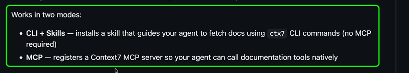

# MCP vs. skill + CLI

Notes on why many developers now give agents a **skill plus a CLI** instead of
an **MCP server**, and when MCP is still the better choice.



Context7 (a documentation service) now ships both options:

- **CLI + Skills**: installs a skill that tells the agent to fetch docs by
  running `ctx7` commands. No MCP needed.
- **MCP**: registers a Context7 MCP server, so the agent calls the
  documentation tools directly.

## The core difference

| | MCP server | Skill + CLI |
|---|---|---|
| What it adds | New **tools**, called through a protocol, each with a fixed input format (schema) | **Instructions** (a markdown file) for using a program in the shell the agent already has |
| What loads up front | Every tool's name, description and input format | Only the skill's one-line description |
| What runs | A server process (local or remote) | A normal command-line program |
| Where it lives | Config in each client app | A folder of text files, versioned in git |

This project's `.claude/skills/feature-spec/` works the skill way. The skill
holds the steps, and the agent does the work with git and ordinary file
edits. No server is involved.

## Why people are switching

### 1. Context cost

Classic MCP loads every tool's details into the context window at the start
of a session, whether the agent uses them or not. With a few servers
connected, that's thousands of tokens gone before the first prompt. For
example, one session with Sanity, Gmail and Google Drive connected had about
80 tools.

A skill costs only its one-line description up front. The full instructions,
and any reference files, load only when the skill is actually used.

> **Caveat:** Claude Code now loads MCP tool details on demand: only tool
> names are listed until a tool is needed. That narrows the token gap, so
> points 2–5 carry most of the argument today.

### 2. Models already know how to use a shell

Models have seen huge amounts of `git`, `gh`, `curl` and `jq` usage in
training. A custom MCP tool is new to them every time.

### 3. You can filter output and chain commands

An MCP tool's full result lands in the context window. CLI output can be
trimmed before the model reads it, saved to a file, or piped into the next
command, all in one step:

```sh
gh pr list --json number,title | jq '.[] | select(.title | test("fix"))'
```

Anthropic's post on running MCP tools through code makes the same argument:
let code handle intermediate data instead of passing it all through the model.

### 4. Less to run and debug

An MCP server is a process you configure for each app, keep running, restart,
and often authenticate through a login flow. Servers that need an OAuth login
can't be used in a non-interactive session at all until someone logs in.

A CLI is a single program. When something breaks, you run the exact command
the agent ran and see the same result.

### 5. A skill carries know-how, not just access

MCP says "here is a tool". A skill says "in this situation, run this, watch
out for that, then do this next". That workflow knowledge is usually what the
agent is missing. And because a skill is a text file, it lives in git and gets
reviewed like code.

## Where MCP still wins

- **No shell available:** claude.ai chat, the desktop chat and mobile have no
  terminal, so MCP is the only way to add tools. This is why Context7 offers
  both modes.
- **Hosted services with shared login:** remote servers (for example, Gmail or
  Google Drive connectors) handle login and permissions centrally.
- **A limited, safer surface:** MCP exposes a few specific operations, while
  shell access can do almost anything. Where security matters, a narrow set of
  typed tools is easier to lock down and audit.

## Rule of thumb

- **Use a skill + CLI** when the agent has a terminal and a good CLI already
  exists.
- **Use MCP** when there's no shell, when login is complex, or when you need
  tight control over what the agent can do.
